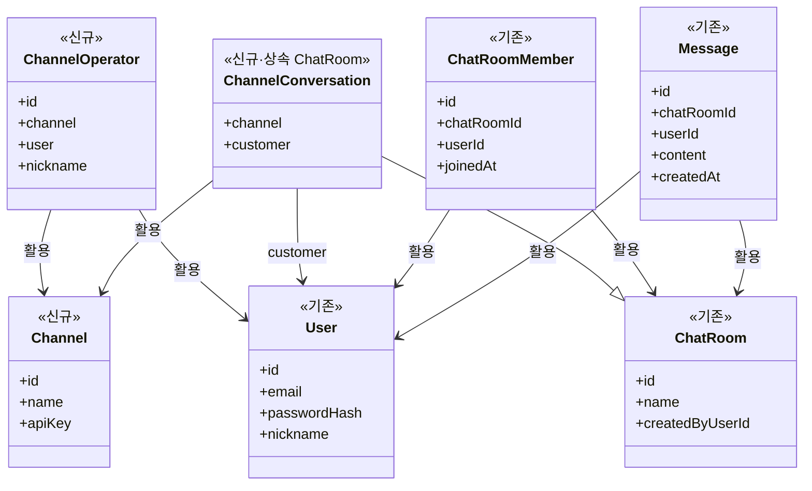

## 프로젝트 요약

- **한 줄 요약**: 채널톡 스타일 B2C 상담 서비스를 위한 도메인 구조 설계 — Channel, ChannelOperator, ChannelConversation 도입 및 기존 ChatRoom 확장
- **키워드**: `도메인 설계`, `Channel`, `ChannelOperator`, `ChannelConversation`, `B2C`, `피드백 창구`

## 문제(AS-IS)

- **User 간 채팅** 구조로, 모두 로그인 필요
- B2C 목표(고객 문의·피드백 수집)에 맞는 **서비스 단위**(위젯 삽입 대상) 도메인 부재
- **상담원(Operator)** vs **고객(Customer)** 역할 구분 없음
- 채널톡처럼 "어느 서비스의 상담인지"를 구분할 수 있는 구조 없음

## 목표(TO-BE)

1. **서비스 단위 도메인**: 위젯이 삽입되는 웹사이트/서비스 단위 표현
2. **상담원 도메인**: 해당 서비스의 관리자·상담원 표현
3. **상담 세션 도메인**: 서비스별 상담 대화 단위 (기존 ChatRoom 확장)
4. **로그인 흐름 통합**: 고객이 채팅 UI 안에서 이메일·비밀번호 입력 → User 생성 → 상담 진행 (별도 Visitor 없음)

## 설계/선택(Key decisions)

| 구분 | 결정 | 이유 |
|------|------|------|
| 서비스 단위 네이밍 | **Channel** | 채널톡 스타일, 채널톡과 용어 일치 |
| 고객 표현 | **User** (로그인 통합) | Visitor 없이 채팅 흐름으로 이메일·비밀번호 입력 → 계정 생성. 도메인 단순화 |
| 상담 세션 | **ChannelConversation** (ChatRoom 상속) | 기존 ChatRoom 활용, channelId 추가로 서비스 단위 연결 |
| 상담원 | **ChannelOperator** | Channel별 운영자, User 참조 |

## 결과(Impact)

- **멀티테넌트**: Channel 단위로 서비스 구분, 위젯별 apiKey 연동 가능
- **상담 흐름**: 방문자 → 위젯 클릭 → 채팅으로 이메일·비밀번호 입력 → User 생성 → 첫 질문 → ChannelConversation 생성 → ChannelOperator가 참여
- **도메인 단순화**: Visitor 없이 User 통합, 기존 ChatRoom·ChatRoomMember·Message 재활용

## 추후 진행할 것
- 위 정의에 맞추어 비즈니스 로직 개발

---

## 설계 상세

### 1) Channel — 서비스 단위

**역할**: 위젯이 삽입되는 웹사이트/서비스 단위. 채널톡의 "채널"과 동일 개념.

```java
class Channel {
    Long id;
    String name;   // 서비스 명 (예: "A 쇼핑몰")
    String apiKey; // 위젯 연동 키
}
```

### 2) ChannelOperator — 채널 운영자

**역할**: 해당 Channel의 상담원. User와 연결하여 로그인·인증 처리.

```java
class ChannelOperator {
    Long id;
    Channel channel;
    User user;      // 로그인 계정
    String nickname; // 상담원 표시명
}
```

### 3) ChannelConversation — 채널별 상담 세션

**역할**: ChatRoom의 확장. 채널에 속한 상담 대화. 고객(User)이 첫 질문 시 생성.

```java
class ChannelConversation extends ChatRoom {
    Channel channel;
    User customer;  // 상담을 요청한 고객
}
```

- **구현**: ChatRoom 상속 또는 ChatRoom에 `channelId` 추가. 기존 `createdByUserId`와 `customer` 역할 구분 가능.

### 4) 상담 흐름

1. 방문자가 사이트 접속 → 우측 하단 위젯 버튼 클릭
2. 채팅 UI에서 이메일·비밀번호 입력 → User 생성 (또는 기존 User 로그인)
3. 첫 질문 전송 → 해당 사이트의 Channel 정보로 **ChannelConversation** 생성
4. ChannelOperator가 **ChannelConversation** 목록 확인 → 참여 → 상담 진행

### 5) 기존 도메인 활용

| 기존 | 활용 |
|------|------|
| User | 고객 + Operator 공통 (로그인 계정) |
| ChatRoom | ChannelConversation의 부모 또는 base |
| ChatRoomMember | 고객·Operator 참여 관리 |
| Message | 그대로 사용 |

---

## 도메인 구조 (TO-BE)



---

## 추후 디벨롭해볼 내용

1. **참여형 콘텐츠**: Engagement, EngagementParticipation 도메인 (2순위 목표)
2. **ChatRoom ↔ Conversation**: ChatRoom을 Conversation으로 명칭 통일 검토
3. **ChannelOperator 권한**: Channel별 상담원 권한·역할 확장
